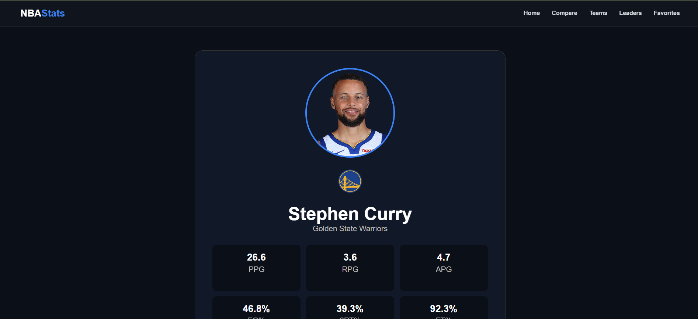
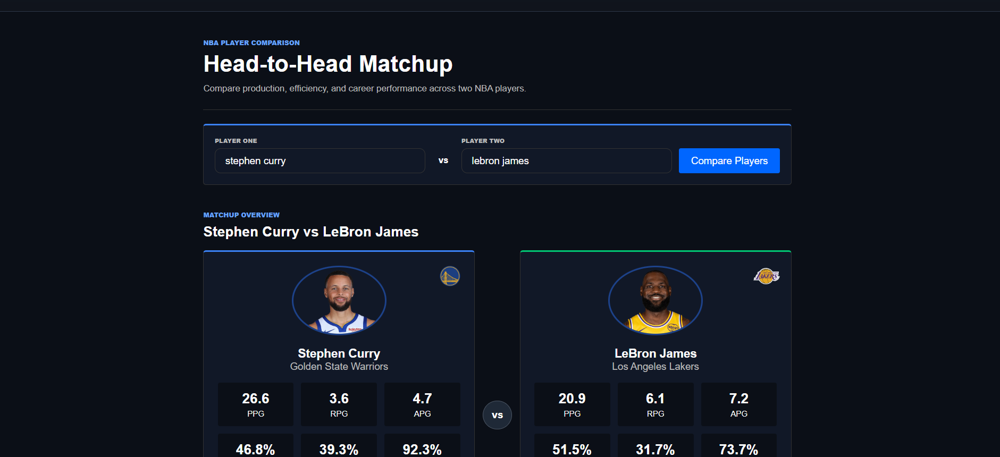
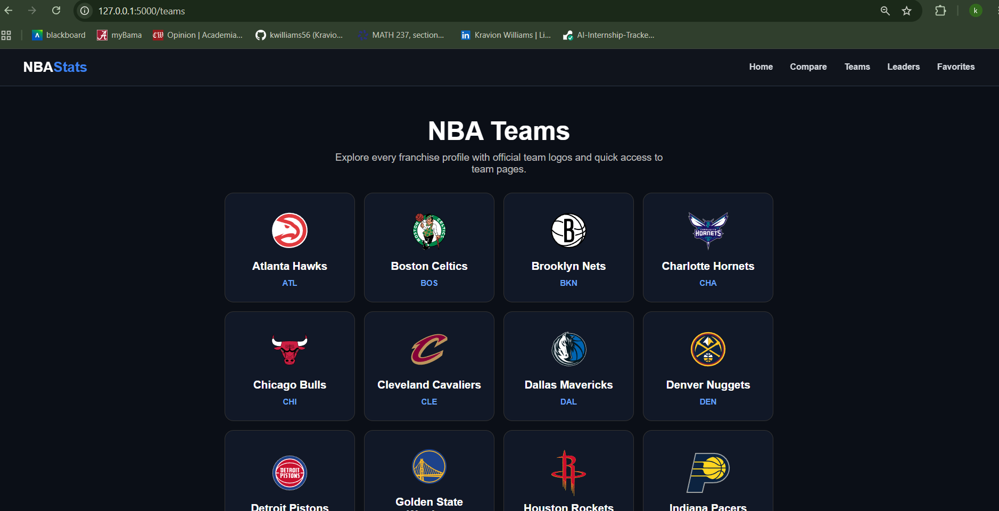
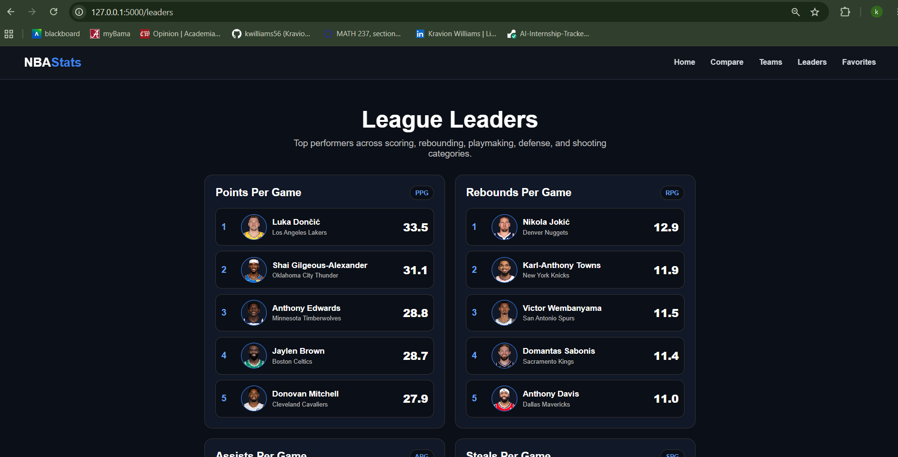
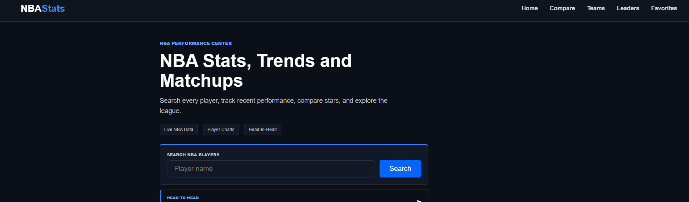

# 🏀 NBA Analytics Dashboard

A modern NBA analytics web application built with **Python, Flask, nba_api, Pandas, and Chart.js**. This application allows users to explore NBA players, compare careers, analyze team statistics, view league leaders, and visualize player performance through an ESPN-inspired interface.

---

## 🌐 Live Demo

**Coming Soon** (Will be updated after Render deployment.)

---

## ✨ Features

### 🔍 Player Search
- Smart player search with duplicate name handling
- Official NBA player headshots
- Official team logos
- Full NBA team names
- Season averages
- Career totals
- Season-by-season career statistics
- Career PPG chart
- Similar Players recommendations

### ⚔️ Player Comparison
- Side-by-side player comparison
- Radar chart visualization
- Career totals comparison
- Career PPG comparison chart
- Winner highlighting for every statistical category

### 🏀 Team Analytics
- Browse all 30 NBA teams
- Individual team pages
- Team rosters
- Team statistics
- Official NBA team logos

### 📊 League Analytics
- League leaders
- Trending players
- Favorites system
- Interactive charts
- Responsive ESPN-inspired interface

### 🛡️ Error Handling
- Custom 404 page
- Custom 500 page
- User-friendly error messages

---

# 📸 Screenshots

## 🏠 Home Page


---

## 👤 Player Profile



---

## ⚔️ Player Comparison



---

## 🏀 Team Pages



---

## 📊 League Leaders



---

## ⭐ Favorites



---

# 🛠️ Technologies Used

- Python
- Flask
- nba_api
- Pandas
- HTML5
- CSS3
- Jinja2
- Chart.js
- Git
- GitHub

---

# 🚀 Installation

Clone the repository:

```bash
git clone https://github.com/kwilliams56/NBA-Stats-Dashboard.git
```

Navigate to the project:

```bash
cd NBA-Stats-Dashboard
```

Create a virtual environment:

```bash
python -m venv venv
```

Activate the virtual environment (Windows Git Bash):

```bash
source venv/Scripts/activate
```

Install dependencies:

```bash
pip install -r requirements.txt
```

Run the application:

```bash
python app.py
```

Open your browser:

```
http://127.0.0.1:5000
```

---

# 🎯 Future Improvements

- Player awards and achievements
- Advanced analytics
- Playoff statistics
- Team vs. Team comparisons
- Mobile application
- User authentication

---

# 👨‍💻 Author

**Kravion Williams**

Computer Science Student  
The University of Alabama

---
