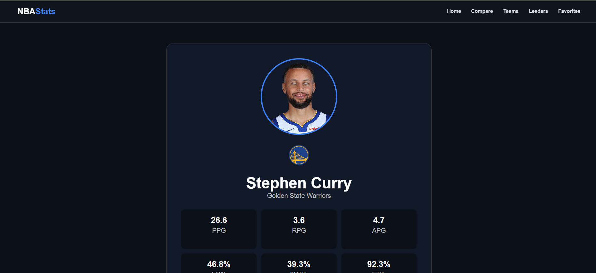
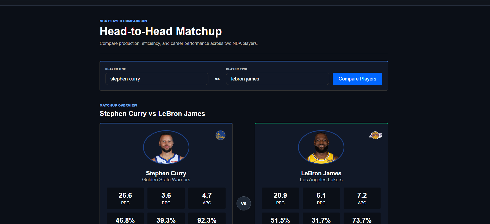
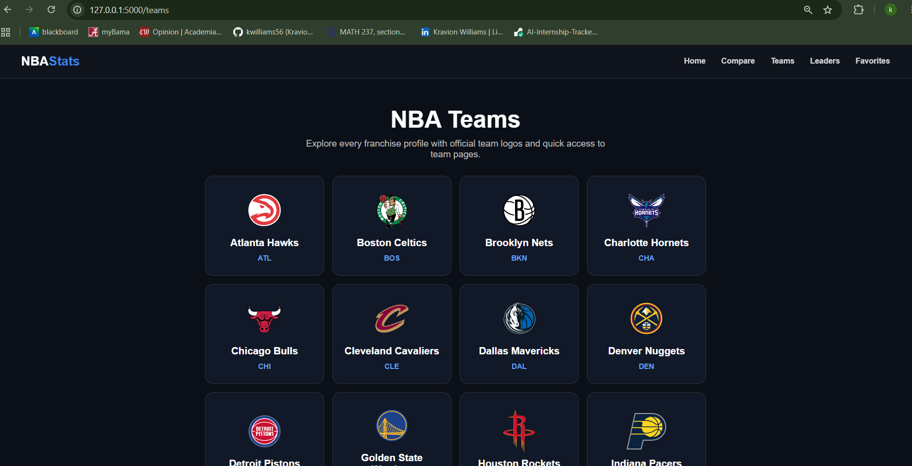
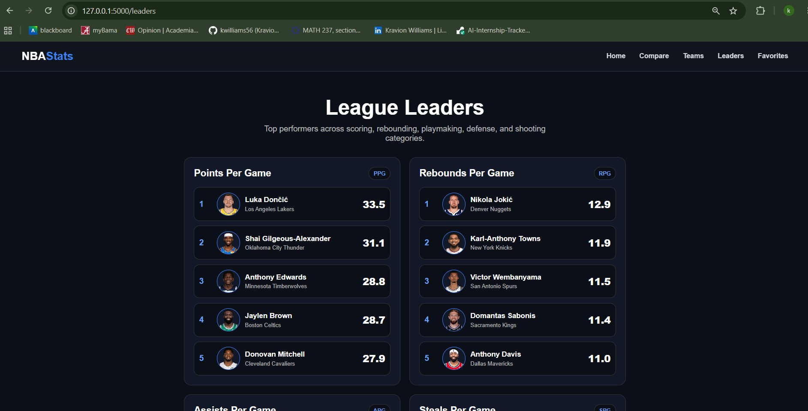
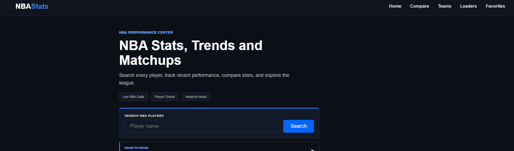

# 🏀 NBA Analytics Dashboard

A modern NBA analytics web application built with **Python, Flask, nba_api, Pandas, and Chart.js**. This application allows users to explore NBA players, compare careers, analyze team statistics, view league leaders, and visualize player performance through an ESPN-inspired interface.

---

## 🌐 Live Demo

🚀 **Live Application:** https://nba-stats-dashboard.onrender.com

---

## ✨ Features

### 🔍 Player Search
- Smart player search with duplicate name handling
- Official NBA player headshots
- Official team logos
- Full NBA team names
- Season averages
- Career totals
- Season-by-season career statistics
- Career PPG chart
- Similar Players recommendations
- Player awards and accomplishments

### ⚔️ Player Comparison
- Side-by-side player comparison
- Radar chart visualization
- Career totals comparison
- Career PPG comparison chart
- Winner highlighting for every statistical category

### 🏀 Team Analytics
- Browse all 30 NBA teams
- Individual team pages
- Team rosters
- Team statistics
- Official NBA team logos

### 📊 League Analytics
- League leaders
- Trending players
- Browser-persistent favorites system
- Interactive charts
- Responsive ESPN-inspired interface

### 🛡️ Error Handling
- Custom 404 page
- Custom 500 page
- User-friendly error messages

---

# 📸 Screenshots

## 🏠 Home Page


---

## 👤 Player Profile



---

## ⚔️ Player Comparison



---

## 🏀 Team Pages



---

## 📊 League Leaders



---

## ⭐ Favorites



---

# 🛠️ Technologies Used

- Python
- Flask
- nba_api
- Pandas
- HTML5
- CSS3
- Jinja2
- Chart.js
- Git
- GitHub

---

# 🚀 Installation

Clone the repository:

```bash
git clone https://github.com/kwilliams56/NBA-Stats-Dashboard.git
```

Navigate to the project:

```bash
cd NBA-Stats-Dashboard
```

Create a virtual environment:

```bash
python -m venv venv
```

Activate the virtual environment (Windows Git Bash):

```bash
source venv/Scripts/activate
```

Install dependencies:

```bash
pip install -r requirements.txt
```

Run the application:

```bash
python app.py
```

Open your browser:

```
http://127.0.0.1:5000
```

---

# Production Cache Setup

This app supports persistent caching with Render Key Value/Redis so NBA API data can survive Render restarts and deployments.

## Emergency BALLDONTLIE Provider Mode

Render may be unable to reliably reach `stats.nba.com`. For production, set the app to use BALLDONTLIE's free-plan endpoints for fast basic player and team pages:

```text
DATA_PROVIDER=balldontlie
BALLDONTLIE_API_KEY=<your BALLDONTLIE API key>
```

In this mode, the homepage, search, fuzzy suggestions, player profile routes, team pages, favorites, and navigation stay functional without calling `stats.nba.com`. Advanced stat-heavy sections show a professional temporary unavailable message until the provider migration is completed.

## Render Environment Variables

Create a Render Key Value instance, then add these environment variables to the web service:

```text
REDIS_URL=<your Render Key Value internal Redis URL>
CACHE_PREWARM_TOKEN=<a long private random token>
DATA_PROVIDER=balldontlie
BALLDONTLIE_API_KEY=<your BALLDONTLIE API key>
```

When `REDIS_URL` is present, the app uses Redis for Flask-Caching. When it is not present, the app uses local `SimpleCache` for development.

## Prewarm the Cache

After deploying, prewarm common NBA data so users do not have to wait on slow first requests:

```bash
flask --app app prewarm-cache
```

You can also trigger prewarming through the protected admin endpoint:

```bash
curl -X POST https://nba-stats-dashboard.onrender.com/admin/prewarm-cache \
  -H "X-Prewarm-Token: <your CACHE_PREWARM_TOKEN>"
```

The endpoint returns JSON showing which datasets succeeded or failed. Do not put the token in the URL.

## Seed Render Redis From Your Computer

If Render cannot reliably reach `stats.nba.com`, use Render Key Value's External URL to seed the same Redis cache from your local machine.

In Render, open your Key Value instance and copy the External Redis URL. Set it locally without committing it:

```powershell
$env:REDIS_EXTERNAL_URL="<your Render Key Value External URL>"
```

Dry-run first to fetch NBA data without writing to Redis:

```powershell
python seed_redis_cache.py --dry-run
```

Seed the Redis cache:

```powershell
python seed_redis_cache.py
```

The script prints a concise success/failure summary and never prints the Redis URL.

## Render Health Check

Set the Render health check path to:

```text
/health
```

The health check does not call the NBA API.

---

# 🎯 Future Improvements

- Advanced analytics
- Playoff statistics
- Team vs. Team comparisons
- Mobile application
- User authentication

---

# 👨‍💻 Author

**Kravion Williams**

Computer Science Student  
The University of Alabama

---

If you enjoyed this project, consider giving the repository a ⭐.
